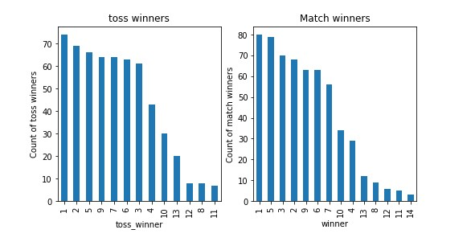
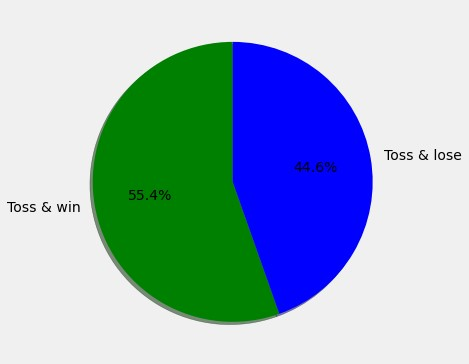
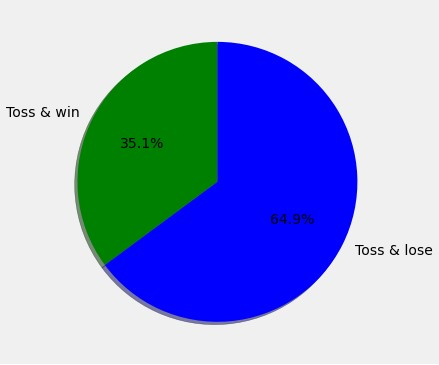
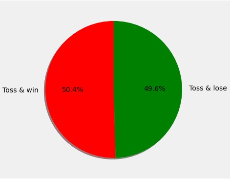
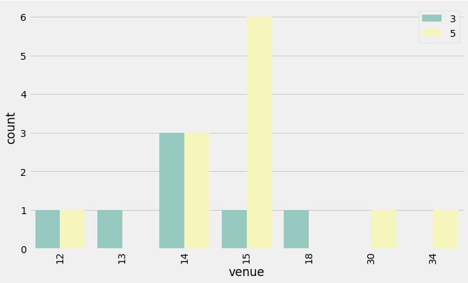

# Cricket Match Result Prediction with Decision Tree

## Abstract
Machine learning is affecting our day to day lives in a rapid and unimaginable way. Among all machine learning algorithm, Decision Tree is a non-parametric supervised learning method used for both classification and regression tasks. The goal is to create a model that predicts the value of a target variable by learning simple decision rules inferred from the data features. That is why, I used Decision Tree algorithm to predict cricket match result with previous data. 

## Introduction
Sport analytics is a very interesting field. Cricket being the most popular sport has many open areas of study and one being the match prediction based on given data. A match’s fate is decided by the team that are participating, the venue, the city, number of wickets, runs etc. It also depends also the toss, the team who wins the toss and decision to bat or field is also crucial. These insights can be drawn by applying machine learning algorithm. So I used Decision Tree and compared it with Gradient boost algorithm to predict cricket match result prediction.

## Dataset
The dataset for this project, matches.csv contains data of the Indian Premier League(IPL) and was collected from espncricinfo. It was web scraped using python and its library was beautiful soup(bs4). This was collected from Priya Bhimjyani’s GitHub repository[1]. The dataset consists of various features . It has 18 columns and 577 rows. 

## Methodology
I used Jupyter Notebook to do this project which has inbuilt python. I used Scikit learn and numpy, pandas and matplot libraries. First I tried to load the data and visualized the data. I saw that all the fields are not filled up. So in winner column, which values are NaN, I replaced it with draw. Then I encoded the team name with their initials and then encoded initials with ids. I used label encoding to encode the city, venue and toss decision into various indexes. Then I analyzed the toss winner and match winner data. I figured out that, toss winning played an important role to win the match for those teams. Then I check if the null values are completed as I encoded the data.

## Results and discussion
I took 5 random data from the IPL 2019 and store it into test.csv file for testing. I feed this in to my model and predicted the outcome and store it into ipl19.csv. This file has all the original test dataset and also the predicted column. I saw that the accuracy of my prediction of IPL is  60%.
| team1   | team2           | city  | toss_winner  | venue    | toss_decision  | date    |winner   |predicted_winner  |
| ------------- |:-------------:| -----:|:-------------:| -----:|:-------------:| -----:|:-------------:|-----:|
| KXIP | MI | 3| MI | 3 | 0 | 11-Apr | MI | KXIP |
| SRH | RR | 5 | RR | 5 | 0 | 27-Apr | RR | RR |
| KKR | MI | 3 | MI | 3 | 0 | 05-May | MI | MI |
|CSK| MI | 7 | CSK | 7 | 1 | 07-May | MI | CSK |
|DC| CSK | 22 | CSK | 24 | 1 | 10-May | CSK | CSK |

Apart from the teams which were participated the tournament, venues and tosses also can play the important role. So I draw pi-chart for various teams of their probability of winning or losing the game with toss.

And also draw the pi-chart of generalized probability for winning match by winning toss. I saw the probability of Winning the toss and match is 50.4%.

Another important factor is the venue. I took top 2 team and analyzed based on number of matches won against each other and how venue affects them. I found that CSK has won most matches against RCB in MA Chidambaram Stadium, Chepauk, Chennai. On the other hand, RCB has not won any match with CSK in stadiums St George's Park and Wankhede Stadium, but won matches with CSK in Kingsmead, New Wanderers Stadium. It does prove that chances of CSK winning is more in Chepauk stadium when played against RCB. It proves venue is important feature in predictability.

## Conclusions and recommendations
I have analyzed the cricket data and shown how some features such as toss decision, toss winner, venue, city etc. decide match’s fate. I have used graphs and figures to make my predictions more visual. There can be more future work in the field of cricket analysis with machine learning. 

## References
* [1] [Dataset](https://github.com/priya-27/Cricket-Prediction)